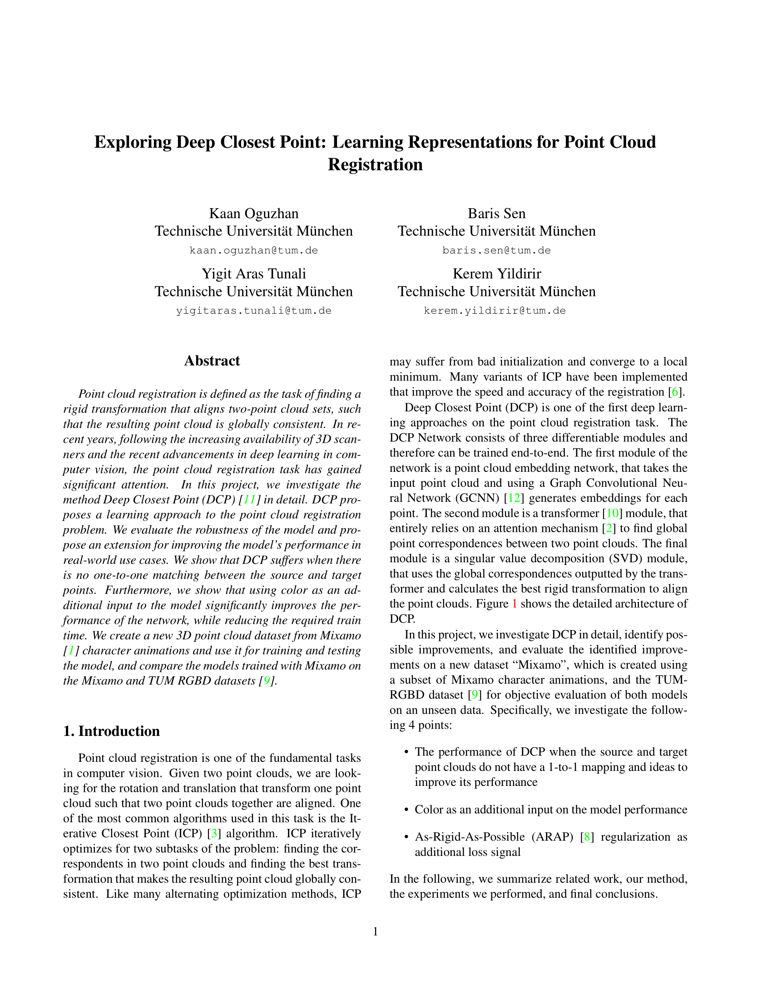
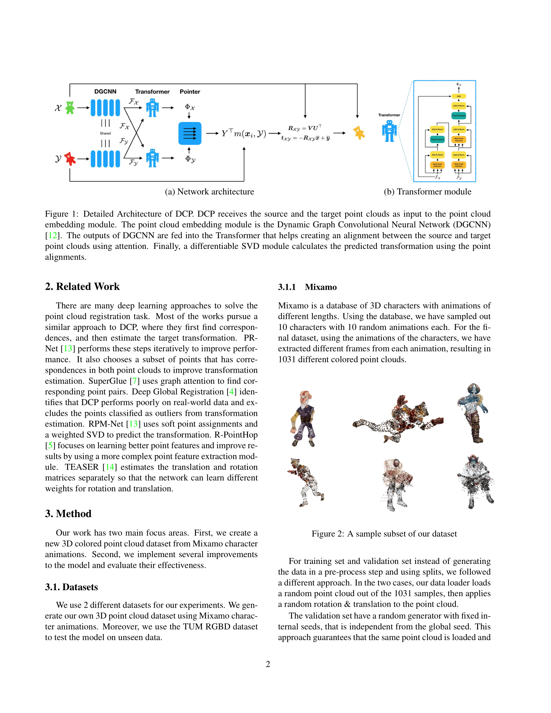
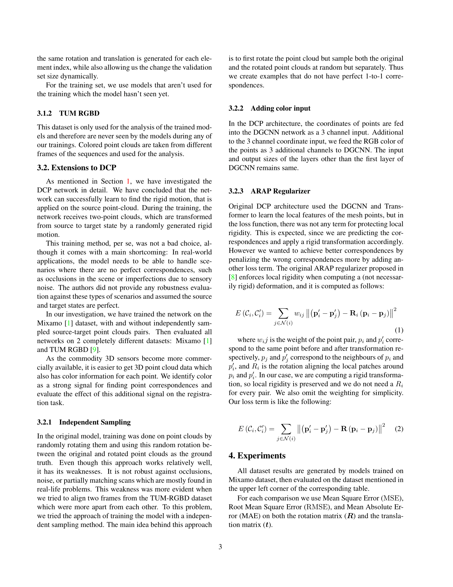
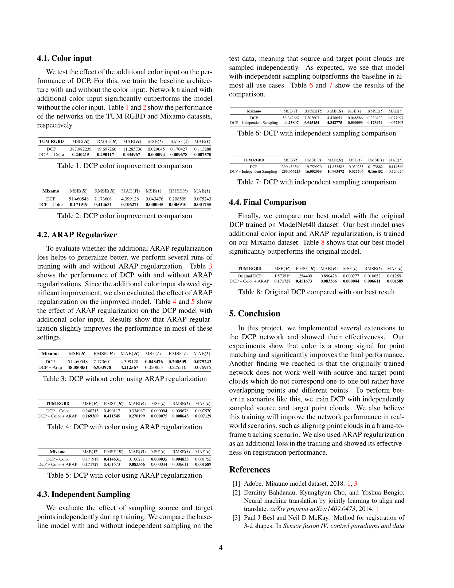
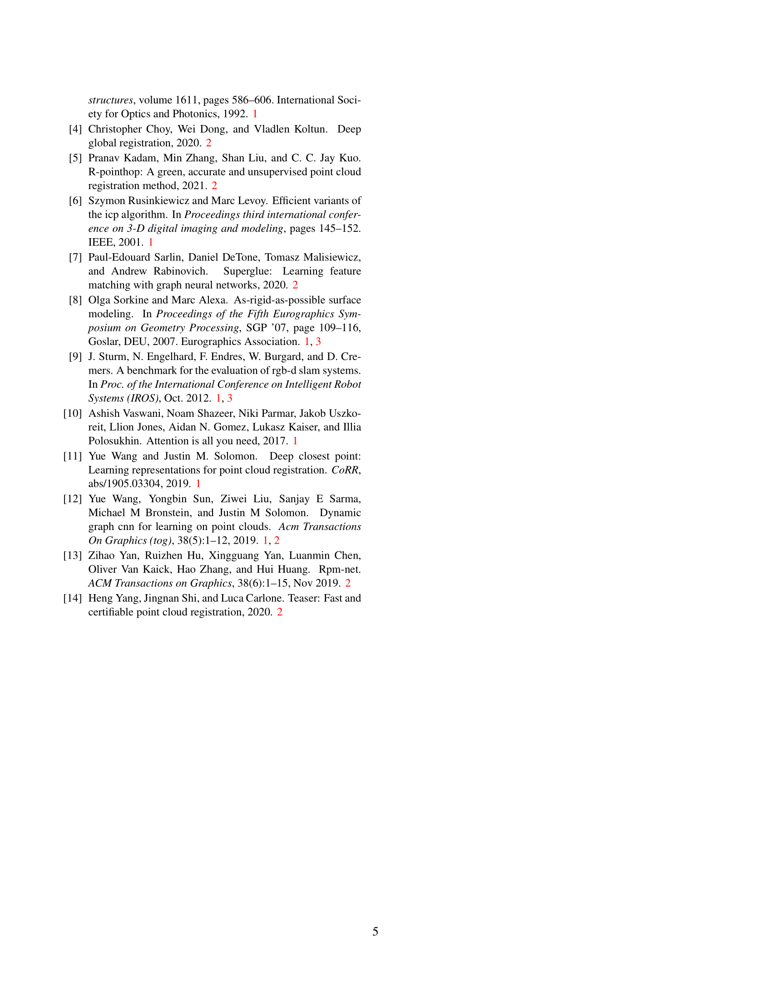

# Exploring Deep Closest Point: Learning Representations for Point Cloud Registration

## Sample Run

```bash
# Example of how to run Training and Testing for color input on our Mixamo dataset

# Training 
python main.py --device cuda:0 --exp-name=color_input --model=dcp --emb-nn=dgcnn --pointer=transformer --head=svd --test-batch-size 5 --dataset mixamo --use-color True --arap True --model-path checkpoints/model_color_input.249.t7

# Test
python main.py --eval --device cuda:0 --exp-name=color_input --model=dcp --emb-nn=dgcnn --pointer=transformer --head=svd --test-batch-size 5 --dataset mixamo --use-color True --arap True --model-path checkpoints/model_color_diffsample.250.t7
```

## Important parameters

```bash
--device cpu # XPU Device to run the model on (eg. cpu, cuda:0, cuda:1)
--use-color True # Flag for using the color as input
--different-sampling True # Flag for using different sampling in source and target
--arap True # Flag for ARAP regularizer
--num-points 1024 # "Num of points to use" 
--dataset mixamo # dataset to use one of the following [modelnet40, mixamo,tumrgbd]
--model-path checkpoints/model_color_input.249.t7 # Path for checkpoint / pretrained model. For training this parameter is used for continuing from a checkpoint. For test it is the path of the pre-trained model
--matching-method # The point matching method, one of the following ['softmax, 'sink_horn']
--num_sk_iter # Number of inner iterations used in sinkhorn normalization if sinkhorn is enabled
```

## Report

For [full report in PDF format click here][PDF]

### Overview

Note: Images are clickable for higher resolution

Page 1                                                  |  Page 2
:------------------------------------------------------:|:----------------------------------------------:
  |  

Page 3                                               |  Page 4                                               |  Page 5
:---------------------------------------------------:|:-----------------------------------------------------:|:-----------------------------------------------------------------------------------------------:
 |   |  |  

[//]: # (These are reference links used in the body of this note and get stripped out when the markdown processor does its job. There is no need to format nicely because it shouldn't be seen. Thanks SO - http://stackoverflow.com/questions/4823468/store-comments-in-markdown-syntax)

   [PDF]: <https://github.com/kaanoguzhan/ml3d/blob/report_and_images/github_resources/ML43D_Final_Report.pdf>
